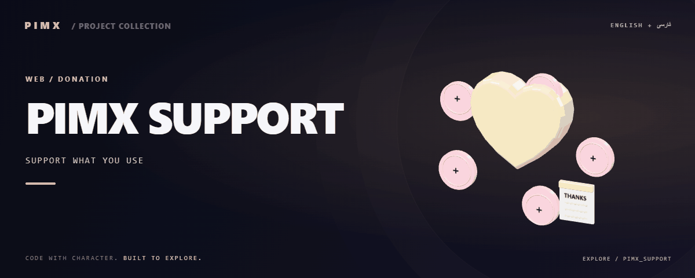
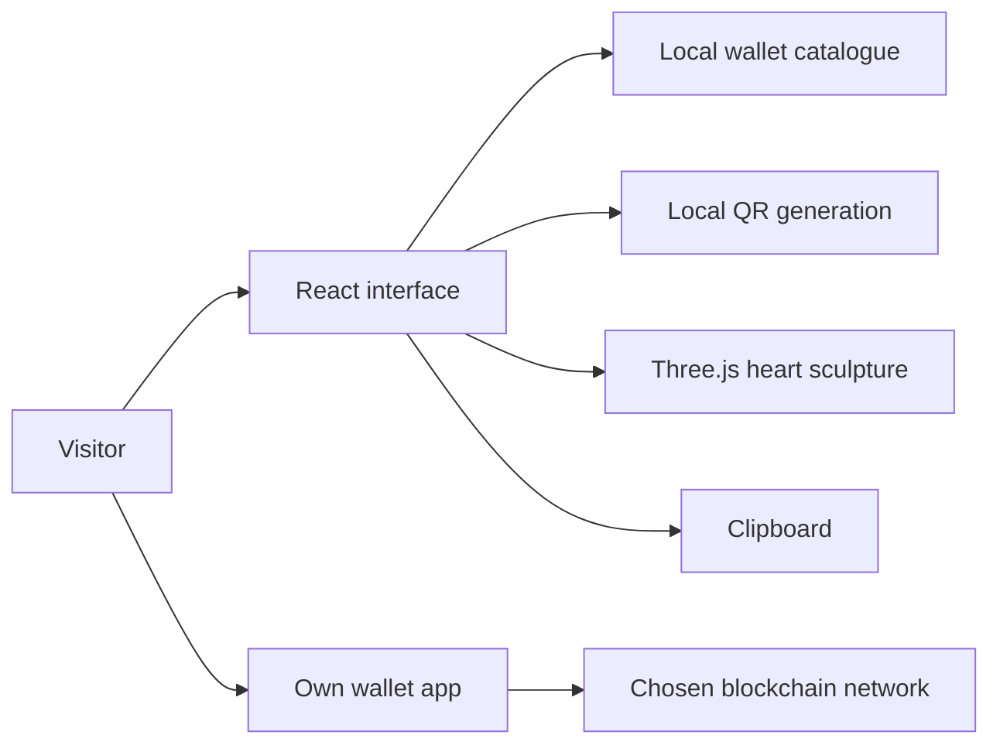

<div align="center">



**[🌐 English](README.md) · [🇮🇷 فارسی](README.fa.md)**

   

</div>

<div dir="rtl">

# 💛 PIMX SUPPORT

**یک همراهی کوچک؛ فرصت بیشتری برای ساختن.**

صفحهٔ شخصی و دو‌زبانهٔ حمایت از مجموعهٔ PIMX. قلب سه‌بعدی تعاملی داستان صفحه را معرفی می‌کند؛ کارت‌های قابل جست‌وجوی کیف‌پول کمک می‌کنند ارز و شبکه را پیدا کنی، آدرس مقصد را کپی یا QR آن را اسکن کنی و از کیف‌پول خودت بفرستی.

[GitHub](https://github.com/MOHAMMADREZAABEDINPOOR/PIMX_SUPPORT) · [PIMX / Profile](https://github.com/MOHAMMADREZAABEDINPOOR) · [PNG](assets/readme/hero.png)

## ✨ امکانات و هویت صفحه

| تجربه | قابلیت موجود |
|:---|:---|
| 💛 هویت سه‌بعدی | قلب Three.js با بارگذاری تنبل و واکنش به حرکت نشانگر |
| 🪙 نه کارت کیف‌پول | بیت‌کوین، اتریوم، BNB، ترون، سولانا، TON، دوج‌کوین و تتر روی دو شبکه |
| 🔎 پیدا کردن مقصد | جست‌وجوی ارز و شبکه، فیلتر دسته‌ها و حالت خالی روشن |
| 📋 کپی و اسکن | آدرس کامل، بازخورد کپی، تولید محلی QR و پنجرهٔ بزرگ‌نمایی |
| 🌐 دو زبان | فارسی راست‌به‌چپ و انگلیسی چپ‌به‌راست با ذخیرهٔ انتخاب زبان |
| 🌗 خواندن راحت | تم روشن و تاریک، چیدمان واکنش‌گرا، رعایت کاهش حرکت و کنترل توقف |
| 📖 داستان انسانی | معرفی شخصی، دلیل حمایت و سؤال‌های قابل باز شدن |
| 🎨 تصویر اختصاصی README | باغ قلب متحرک با سکه‌ها، کارت تشکر و جوانهٔ رشد |

## 🧭 مسیر استفاده

۱. کارت ارز و شبکه را مرور یا جست‌وجو کن.
۲. شبکهٔ دقیق را انتخاب کن تا آدرس کامل مقصد را ببینی.
۳. آدرس را کپی کن یا QR را باز کن.
۴. مقصد را در کیف‌پول خودت بررسی و انتقال را همان‌جا انجام بده.

این صفحه مقصدهای حمایت را نمایش می‌دهد. اتصال کیف‌پول، دریافت کلید خصوصی، ایجاد درخواست پرداخت، تأیید تراکنش یا سیستم تیکت پشتیبانی در آن پیاده‌سازی نشده است.

## 🚀 اجرای محلی

از **Node.js 22.12 یا جدیدتر** و **pnpm 10.4.1** مطابق `package.json` استفاده کن.

<div dir="ltr">

```bash
git clone https://github.com/MOHAMMADREZAABEDINPOOR/PIMX_SUPPORT.git
cd PIMX_SUPPORT
npx --yes pnpm@10.4.1 install --frozen-lockfile
npm run dev
```

</div>

آدرس نمایش‌داده‌شده توسط Vite را باز کن؛ معمولاً `http://localhost:5173` است. در ویندوز، `run.cmd` در صورت نیاز وابستگی‌ها را نصب می‌کند، خروجی برنامه را می‌سازد و سرور را روی پورت ۳۰۰۰ اجرا می‌کند.

## 🧰 ابزارها و فرمان‌ها

| فرمان | کاربرد |
|:---|:---|
| `npm run dev` | سرور توسعهٔ Vite |
| `npm run check` | بررسی نوع‌های TypeScript |
| `npm run build` | ساخت رابط در `dist/public` و سرور در `dist/index.js` |
| `npm run preview` | پیش‌نمایش خروجی رابط |
| `npm start` | ارائهٔ خروجی تولید با Express |
| `npm run format` | قالب‌بندی سورس با Prettier |

رابط با React 19، TypeScript 5.6، Vite 7، Tailwind 4، Framer Motion، Three.js، Radix Dialog، Lucide و QRCode ساخته شده است. Express برای میزبانی اختیاری Node است. پچ ثبت‌شدهٔ Wouter بخشی از نصب pnpm محسوب می‌شود.

## ⚙️ شخصی‌سازی صفحه

| فایل | محل تغییر |
|:---|:---|
| [wallets.ts](client/src/lib/wallets.ts) | آدرس کیف‌پول‌ها، شبکه‌ها، دسته‌ها و مشخصات ارز |
| [Home.tsx](client/src/pages/Home.tsx) | متن انگلیسی و فارسی، داستان، سؤال‌ها و مسیر حمایت |
| [SupportSculpture.tsx](client/src/components/SupportSculpture.tsx) | مجسمهٔ سه‌بعدی تعاملی |
| [locale.ts](client/src/lib/locale.ts) | ذخیرهٔ زبان و جهت صفحه |
| [ThemeContext.tsx](client/src/contexts/ThemeContext.tsx) | انتخاب تم |
| [index.css](client/src/index.css) | چیدمان، فونت‌ها و هویت بصری |

این صفحه به کلید ارائه‌دهندهٔ هوش مصنوعی نیاز ندارد. `PORT` پورت سرور اختیاری Express را تعیین می‌کند و مقدار پیش‌فرض آن ۳۰۰۰ است. زبان اولیهٔ رابط فارسی و زبان پیش‌فرض README انگلیسی است.

## 🗺️ معماری

<div dir="ltr">



</div>

## 🌍 استقرار

### Cloudflare Pages / میزبانی ایستا

فرمان ساخت `npm run build` و **پوشهٔ خروجی `dist/public`** است. فایل سرور Express جداست و میزبان ایستا به آن نیاز ندارد. Node 22.12 یا جدیدتر و نصب pnpm از lockfile را تنظیم کن؛ در صورت نیاز میزبان، fallback مسیرهای SPA را اضافه کن.

### میزبانی Node

<div dir="ltr">

```bash
npm run build
npm start
```

</div>

آدرس عمومی موجود `https://pimxsupport.pages.dev/` در بررسی زمان انتشار پاسخ **۴۰۴** داد. انتشار سورس در GitHub به‌تنهایی به معنی کامل شدن استقرار Pages نیست.

## 🧪 بررسی تغییرات

فرمان‌های `npm run check` و `npm run build` را اجرا کن. در مرورگر، تغییر زبان، راست‌به‌چپ، هر دو تم، جست‌وجوی ارز، فیلترها، کپی آدرس، بزرگ‌نمایی QR، سؤال‌ها و دکمهٔ توقف حرکت را بررسی کن. حالت کاهش حرکت را هم ببین. این‌ها مراحل بررسی‌اند و ادعای تأیید همهٔ مرورگرها نیستند.

## 🛠️ رفع مشکل

| مشکل | بررسی |
|:---|:---|
| صفحهٔ استقرار ایستا خالی است یا ۴۰۴ می‌دهد | از `dist/public` استفاده کن و ساخت موفق و مسیریابی میزبان را بررسی کن |
| کپی در دسترس نیست | از HTTPS یا localhost استفاده کن؛ اگر دسترسی کلیپ‌بورد رد شد، آدرس کامل را دستی انتخاب کن |
| سرور Node صفحه ندارد | ابتدا خروجی را بساز؛ سرور از `dist/public` استفاده می‌کند |
| نصب وابستگی‌ها ناموفق است | نسخهٔ اعلام‌شدهٔ pnpm و پچ Wouter را نگه دار |

## 🤝 مشارکت

تغییر را مشخص نگه دار، هر دو زبان را حفظ کن و چیدمان موبایل را بررسی کن. پیش از استقرار، تغییر آدرس‌ها باید با مالک و شبکهٔ موردنظر تطبیق داده شود.

## 📄 مجوز

در `package.json` مجوز MIT اعلام شده است؛ در این نسخه فایل مستقل LICENSE وجود ندارد.

---

ساخته‌شده با علاقه توسط **محمدرضا عابدین‌پور** · بخشی از **PIMX**.

</div>
