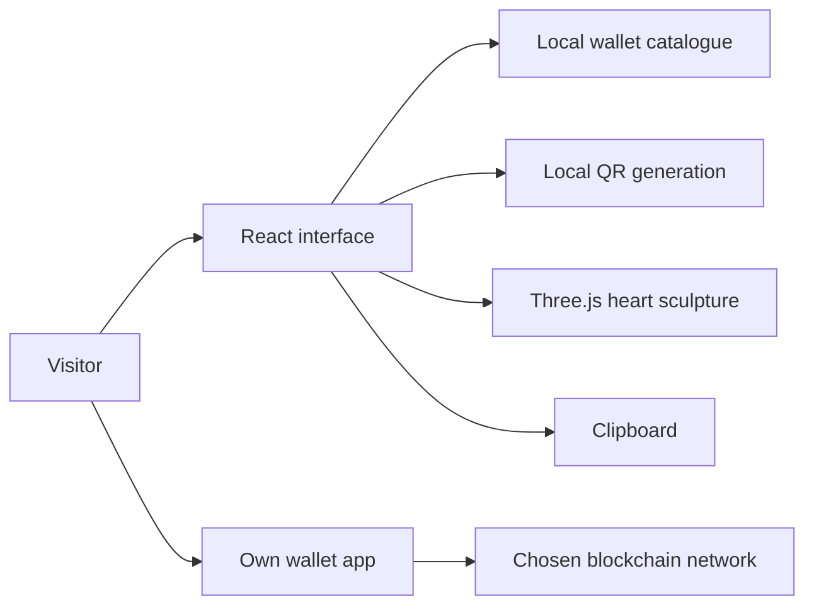

<div align="center">


**[🌐 English](README.md) · [🇮🇷 فارسی](README.fa.md)**

   

</div>

# 💛 PIMX SUPPORT

**A little heart. More room to build.**

A personal, bilingual support page for the PIMX ecosystem. A sculpted interactive heart introduces the story; searchable wallet cards help visitors find the asset and network, copy a destination address or scan its QR code, then send from their own wallet.

[GitHub](https://github.com/MOHAMMADREZAABEDINPOOR/PIMX_SUPPORT) · [PIMX / Profile](https://github.com/MOHAMMADREZAABEDINPOOR) · [PNG](assets/readme/hero.png)

## ✨ What makes it personal

| Experience | Included behavior |
|:---|:---|
| 💛 Three-dimensional identity | Lazy-loaded Three.js heart sculpture with pointer interaction |
| 🪙 Nine wallet cards | Bitcoin, Ethereum, BNB, TRON, Solana, TON, Dogecoin and Tether on two networks |
| 🔎 Find a destination | Asset/network search, category filters and a clear empty state |
| 📋 Copy and scan | Full address, copy feedback, locally generated QR and an enlarged QR dialog |
| 🌐 Two languages | Persian RTL and English LTR with saved language selection |
| 🌗 Make it comfortable | Light/dark themes, responsive layouts, reduced-motion support and pause control |
| 📖 The human story | Personal introduction, the reason for support and expandable FAQ |
| 🎨 Original README artwork | An animated heart garden with coins, a thank-you card and a growing sprout |

## 🧭 How visitors use it

1. Browse or search the asset and network cards.
2. Select the exact network to see the full destination address.
3. Copy the address or open the QR dialog.
4. Check the destination in your own wallet and send there.

The page displays donation destinations. It does not connect wallets, collect private keys, create payment requests, confirm transactions or operate a support-ticket system.

## 🚀 Run locally

Use **Node.js 22.12+** and **pnpm 10.4.1**, as declared in `package.json`.

```bash
git clone https://github.com/MOHAMMADREZAABEDINPOOR/PIMX_SUPPORT.git
cd PIMX_SUPPORT
npx --yes pnpm@10.4.1 install --frozen-lockfile
npm run dev
```

Open the URL printed by Vite, normally `http://localhost:5173`. On Windows, `run.cmd` installs dependencies when needed, builds the application and starts the bundled server on port 3000.

## 🧰 Stack and commands

| Command | Purpose |
|:---|:---|
| `npm run dev` | Vite development server |
| `npm run check` | TypeScript type checks |
| `npm run build` | Build `dist/public` and the Node server in `dist/index.js` |
| `npm run preview` | Preview the built browser application |
| `npm start` | Serve the production build using Express |
| `npm run format` | Format source using Prettier |

React 19, TypeScript 5.6, Vite 7, Tailwind 4, Framer Motion, Three.js, Radix Dialog, Lucide and QRCode power the interface. Express serves the optional Node deployment. The committed pnpm patch for Wouter is part of the install.

## ⚙️ Customize the page

| File | Edit here |
|:---|:---|
| [wallets.ts](client/src/lib/wallets.ts) | Wallet addresses, networks, categories and asset metadata |
| [Home.tsx](client/src/pages/Home.tsx) | English/Persian copy, story, FAQ and support flow |
| [SupportSculpture.tsx](client/src/components/SupportSculpture.tsx) | Interactive native 3D sculpture |
| [locale.ts](client/src/lib/locale.ts) | Language persistence and document direction |
| [ThemeContext.tsx](client/src/contexts/ThemeContext.tsx) | Theme selection |
| [index.css](client/src/index.css) | Layout, fonts and visual identity |

No AI provider key is required for this page. `PORT` configures the optional Express server, defaulting to 3000. The initial interface language is Persian; the README defaults to English.

## 🗺️ Architecture



## 🌍 Deploy

### Cloudflare Pages / static hosting

Use build command `npm run build` and **output directory `dist/public`**. The Express bundle is separate and is not needed by a static host. Configure Node 22.12+ and ensure pnpm installs from the checked-in lockfile; add SPA routing fallback if your host requires it.

### Node hosting

```bash
npm run build
npm start
```

The existing public address `https://pimxsupport.pages.dev/` returned **404** during the publication check. Uploading this source to GitHub does not by itself establish a working Pages deployment.

## 🧪 Verify your changes

Run `npm run check` and `npm run build`. In a browser, check English/Persian switching, RTL layout, both themes, asset search, filters, address copy, QR enlargement, FAQ controls and the motion pause button. Use reduced-motion mode to review the fallback. These are verification steps, not a claim that every browser is certified.

## 🛠️ Troubleshooting

| Symptom | Check |
|:---|:---|
| Static deployment is blank or 404 | Use `dist/public`, publish a successful build and check host routing |
| Copy is unavailable | Use HTTPS or localhost; manually select the full address if clipboard permission is denied |
| Node server has no page | Run the build first; the server serves `dist/public` |
| Dependency installation fails | Use the declared pnpm version and retain the Wouter patch |

## 🤝 Contribute

Keep changes focused, preserve both languages and check mobile layouts. Wallet changes must be reviewed against their intended owner and network before a deployment.

## 📄 License

`package.json` declares MIT. This snapshot contains no separate repository-level LICENSE file.

---

Built with heart by **Mohammadreza Abedinpoor** · Part of **PIMX**.
